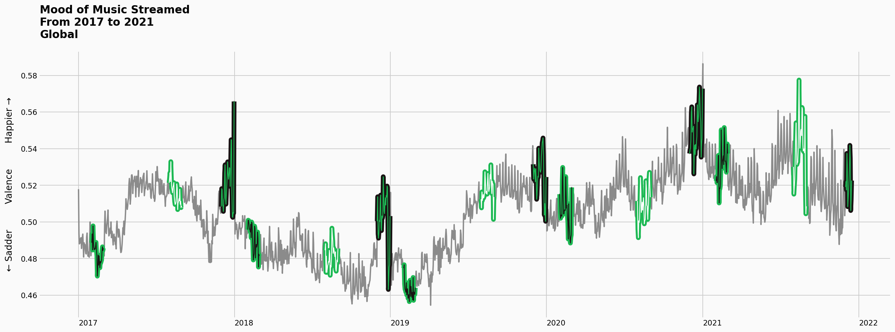

# STAT 5106 Final Project - Spotify and Happiness Index Data Analysis Report


**Group 7 Member List**
=
- 1007628404 Lee Ling
- 1155015951 Law Chun Hoi
- 1155034310 Wong Sui Hong	
- 1155167073 Cheng Ho Yeung 
- 1155169045 Pang Ka Wing

Table of content
=
1. <a href="#1-introduction">Introduction</a>
2. <a href="#2-description-of-the-data-source-and-data-pre-processing">Description of the Data Source, and Data Pre-processing</a>
3. <a href="#3-data-processing">Data Processing</a>
4. <a href="#4-data-analysis-and-visualisation">Data Analysis and Visualisation</a>
5. <a href="#5-little-side-project">Little Side Project</a>
6. <a href="#6-conclusion">Conclusion</a>

# 1. Introduction

On 8th February 2020, the Economist published an article titled [“Sad songs say so much: Data from Spotify suggest that listeners are gloomiest in February”](https://www.economist.com/graphic-detail/2020/02/08/data-from-spotify-suggest-that-listeners-are-gloomiest-in-february). The Economist found that the global top 200 songs were the gloomiest in February, the perkiest in July and the most joyful spike came at Christmas. It suggested that the global dip was perhaps explained simply by the calendar. For most people, the first weeks of a promising new year have disappeared with little sign of improvement. 

In this project, we would like to explore the cultural characteristics, the similarities and differences of various countries as revealed by people’s choice of Spotify music. We aim to achieve the following objectives:

1. To figure out if there are any noticeable patterns among the choice of Spotify musics among different countries
2. To figure out the moods of Spotify music that people of different countries / cities listen to
3. To figure out the key factors accounting for the similarities / differences observed 
4. To figure out if the choice of Spotify music of different countries / cities has reference value to the World Happiness Index

The following data sources are used in this project:
-
1. <a href="#21-spotify-charts-website">Spotify Charts Website</a>
2. <a href="#22-spotify-web-api">Spotify Web API</a>
3. <a href="#23-country-and-language">Country and Language</a>
4. <a href="#24-hapniess-index">Happiness Index</a>

# 2. Description of the Data Source and Data Pre-processing

# 2.1 [Spotify Charts Website](https://spotifycharts.com/)

Spotify Charts is powered and maintained by Spotify to provide ranking of the most streamed tracks on Spotify. Spotify Charts have built-in filters including location (global and respective countries / cities), time frame (daily and weekly, and then specific week or date). The charts can be dated back to 1 January 2017. In this project, we retrieved the data of daily streaming ranking (1-200) on Spotify for analysis by building a web scraping function. 
The following steps have been taken for retrieving the daily charts of the 200 most-streamed songs, both worldwide and in each country.

## 2.1.1 Examine the website link


We observed from the website link that the location, chart type and time frame parameters are included in the website link. To view and retrieve the Spotify Charts data of different countries and dates, we can simply alter the country code (e.g. us, sk and hk) and date of the chart.

## 2.1.2 Inspect the source code of the website


By inspecting the source code, respective data points that we are interested in retrieving are identified and highlighted in the above figure.

## 2.1.3 Build a class to scrap the data, and pre-process the data

```python
class Rankings
```

<details>
	<summary>click to expand for source code</summary>

[source code](Scraper_Ranking.py)

```python
class Rankings:

    def __init__(self):
        self.data_dir = get_data_dir()
        self.not_downloaded = ""
        self.newly_downloaded_path = ""

    def check_if_downloaded(self):

        session = HTMLSession()
        r = session.get('https://spotifycharts.com/regional/global/daily/latest')

        dict_available_country = {'code': [], 'name':[]}
        for i in r.html.find("div[data-type=country]"):
            for j in i.find("li[data-value]"):
                dict_available_country['code'].append(j.attrs['data-value'])
                dict_available_country['name'].append(j.text)
        df_available_country = pd.DataFrame(dict_available_country)

        dict_available_date = {'date': []}
        for i in r.html.find("div[data-type=date]"):
            for j in i.find("li[data-value]"):
                dict_available_date['date'].append(j.text)
        df_available_date = pd.DataFrame(dict_available_date)
        df_available_date['date'] = pd.to_datetime(df_available_date['date'], errors="coerce")
        df_available_date['date'] = df_available_date['date'].dt.strftime('%Y-%m-%d')

        downloaded = []
        for i in self.data_dir.glob('**/*.csv'):
            downloaded.append(i.stem)

        available = [f'{code} {date}' 
                     for code in df_available_country['code'].tolist() 
                     for date in df_available_date['date'].tolist()]

        not_downloaded = set(available) - set(downloaded)

        if not_downloaded:
            print(f"----------Outstanding {len(not_downloaded)} Records----------")
        else:
            print("----------All Records Downloaded---------")

        self.not_downloaded = not_downloaded

    def download_new_data(self):

        self.newly_downloaded_path = [] 

        for to_download in sorted(self.not_downloaded):
            
            country, date = to_download.split()
            print(f"---------To download {country} {date}---------", end='\r')
            
            country_dir = (self.data_dir / f'{country}')
            country_dir.mkdir(exist_ok=True)
            
            session = HTMLSession()
            r = session.get(f'https://spotifycharts.com/regional/{country}/daily/{date}')
            
            data = {'date': [], 'url': [], 'image': [], 'position': [], 'track': [], 'streams': []}

            for i in r.html.find('td.chart-table-image'):
                data['date'].append(date)
                data['url'].append(i.find('a', first=True).attrs['href'])
                data['image'].append(i.find('img', first=True).attrs['src'])

            for i in r.html.find('td.chart-table-position'):
                data['position'].append(i.text)

            for i in r.html.find('td.chart-table-track'):
                data['track'].append(i.text)
                
            for i in r.html.find('td.chart-table-streams'):
                data['streams'].append(i.text)
                
            pd.DataFrame(data).to_csv(country_dir / f'{country} {date}.csv')

            self.newly_downloaded_path.append(country_dir / f'{country} {date}.csv')

        print("----------All Records Downloaded---------")

    def format_ranking_df(self, df_ranking: pd.DataFrame):
        col = ['date', 'country_code', 'position', 'artist', 'track', 'track_id', 'url', 'image', 'streams']
        if df_ranking.empty:
            return pd.DataFrame(columns=col)
        df_ranking[['track', 'artist']] = df_ranking['track'].str.split(' by ', n=1, expand=True)
        df_ranking['track_id'] = df_ranking['url'].str.extract(r"([^\/]+$)")
        df_ranking = df_ranking[~(df_ranking['track_id'] == '#')]
        df_ranking = df_ranking[col]
        
        df_ranking.sort_values(['date', 'country_code', 'position'], inplace=True)
        df_ranking.reset_index(drop=True, inplace=True)

        df_ranking['date'] = pd.to_datetime(df_ranking['date'], errors='coerce')
        df_ranking['position'] = pd.to_numeric(df_ranking['position'], errors='coerce')
        df_ranking['streams'] = pd.to_numeric(df_ranking['streams'].str.replace(',', ''), errors='coerce')

        return df_ranking

    def import_ranking_csv(self, file_path: Path):
        col = ['date', 'country_code', 'url', 'image', 'position', 'track', 'streams']
        df_ranking = pd.read_csv(file_path)
        if df_ranking.empty:
            return pd.DataFrame(columns=col)
        try:
            country_code, _ = file_path.stem.split()
        except:
            print(file_path.stem)
        df_ranking['country_code'] = country_code
        df_ranking = df_ranking[col]
        return self.format_ranking_df(df_ranking)

    def import_ranking_csvs(self, list_file_path=None):
        if not list_file_path:
            list_file_path = self.data_dir.glob('**/* *-*-*.csv')
        list_ranking = []
        for file_path in list_file_path:
            list_ranking.append(dask.delayed(self.import_ranking_csv)(file_path))
        delayed_list = dask.delayed(pd.concat)(list_ranking, axis=0, sort=False)
        with dask.diagnostics.ProgressBar():
            df_ranking = delayed_list.compute()
        return df_ranking

    def update_ranking_db(self, database='spotify'):
        if (self.newly_downloaded_path != []) or (not (self.data_dir / f'{database}.db').is_file()):
            df_to_update = self.import_ranking_csvs(self.newly_downloaded_path)
            df_to_update = df_to_update[~(df_to_update['track_id'] == "#")].reset_index(drop=True)
            df_to_update.sort_values(['date', 'country_code', 'position'], inplace=True)
            self.export_to_db(df_to_update, table='Ranking', database=database, if_exists='append')
        else:
            print("----------No oustanding record to update to db----------")

    def import_from_db(self, query_string=None, query_params=None, database='spotify', verbose=True):
        start_time = time.time()
        db_dir = self.data_dir / f'{database}.db'
        engine = create_engine(f'sqlite:///{db_dir}')
        df = pd.read_sql(query_string, engine, params=query_params)
        engine.dispose()
        end_time = time.time()
        if verbose: 
            print(f'{database:.<50} ready by {end_time - start_time:.3f}s' )
        return df

    def export_to_db(self, df, table, database='spotify', if_exists='append'):
        sqlite3.register_adapter(np.int64, lambda val: int(val))
        start_time = time.time()
        db_dir = self.data_dir / f'{database}.db'
        engine = create_engine(f'sqlite:///{db_dir}')
        df.to_sql(table, engine, if_exists=if_exists, index=False)
        engine.dispose()
        end_time = time.time()
        print(f'{database:.<50} ready by {end_time - start_time:.3f}s' )
```

</details>

## 2.1.4 Add the country code, and date into the individual data frames by country and date, and combine it into a single data frame

```python
def get_country_codes
```

<details>
	<summary>click to expand for source code</summary>

[source code](Spotify_Project.py)

```python
def get_country_codes():

    url_country_codes = "https://raw.githubusercontent.com/datasets/country-codes/master/data/country-codes.csv"
    df = pd.read_csv(url_country_codes)
    df.columns = df.columns.str.lower()

    df['country_code'] = df['iso3166-1-alpha-2'].str.lower()
    df['country_code_alpha3'] = df['iso3166-1-alpha-3'].str.upper()
    df['country'] = df['unterm english short'].apply(lambda text: str(text).split(' (')[0])
    df['country'].replace('United States of America', 'United States', inplace=True)
    df['country'].replace('United Kingdom of Great Britain and Northern Ireland', 'United Kingdom', inplace=True)
    df.loc[df['iso3166-1-alpha-2'] == 'TW', 'country'] = 'Taiwan'
    df.loc[df['iso3166-1-alpha-2'] == 'TW', 'region name'] = 'Asia'
    df.loc[df['iso3166-1-alpha-2'] == 'TW', 'sub-region name'] = 'Eastern Asia'
    df.loc[df['iso3166-1-alpha-2'] == 'HK', 'country'] = 'Hong Kong'


    url_iso_639 = "https://raw.githubusercontent.com/ringolee0823/STAT5106/main/iso-639-3.tab"
    df_iso_639 = pd.read_csv(url_iso_639, delimiter='\t')
    df_iso_639.columns = df_iso_639.columns.str.lower()
    df_iso_639 = df_iso_639.dropna(subset=['part1'])[['part1', 'ref_name']]

    list_languages = [(i[1]['part1'], i[1]['ref_name']) for i in df_iso_639.iterrows()]

    df['languages_list'] = df['languages'].apply(lambda x: [re.sub('-.*', '', i) for i in str(x).split(',')])
    df['languages_list'] = df['languages_list'].apply(lambda x: [x[0]] if x else [""])

    df['languages_name'] = df['languages_list'].apply(lambda x: [k[1] for k in list_languages if k[0] in x])
    df['languages_name'] = df['languages_name'].apply(lambda x: x[0] if x else "")

    df = df[['country_code', 'country_code_alpha3', 'continent', 'region name', 'sub-region name', 'languages_name', 'country']]

    df.columns = df.columns.str. \
                    replace(" ", "_").str. \
                    replace("-", "_")
    
    return df
```
</details>

## 2.1.5 Demography of the Spotify Charts Data Frame


1. `position`: The rank of the song by the number of times it has been streamed on Spotify on the given date (from 1 to 200).
2. `track`: The title of the song
3. `artist`: The artist(s) of the song
4. `streams`: The number of times it has been streamed on Spotify on the given date
5. `url`: The link access the track on Spotify, and it contains the track’s id at the end of the link
6. `track_id`: track’s unique Spotify identification code
7. `country_code`: The country code representing the respective country
8. `date`: The year, month and date for the data

# 2.2 [Spotify Web API](https://api.spotify.com)

Spotify Web API allows developers to obtain audio features of the Spotify music for analysis. The base address of Web API is https://api.spotify.com. For accessing the API, Client Credentials are being set up. We also note that there is a Python library Spotipy available in. Therefore, we make use of the Python library together with the Spotify API for our analysis. 

```python
import spotipy, re
from spotipy.oauth2 import SpotifyClientCredentials
```

<details>
	<summary>click to expand for source code</summary>

[source code](Scraper_Feature.py)

```python
class Features:
    
    def __init__(self):
        self.sp = access_api(API_KEY.CLIENT_ID, API_KEY.CLIENT_SECRET)
        self.data_dir = get_data_dir()

    def save_csv(self, df, file_name='features', mode='a', header=False):
        with open(self.data_dir / f'df_{file_name}.csv', mode, newline='', encoding="utf-8") as f:
            df.to_csv(f, index=False, header=header)

    def check_if_downloaded(self, df_source, file_name):
        imported_track_ids = df_source['track_id'].unique().tolist()
        if (self.data_dir / f'df_{file_name}.csv').is_file():
            df_downloaded = pd.read_csv(self.data_dir / f'df_{file_name}.csv')
            downloaded_track_ids = df_downloaded['track_id'].unique().tolist()
            new_track_ids = list(set(imported_track_ids) - set(downloaded_track_ids))
            downloaded = True
            return new_track_ids, downloaded
        else:
            new_track_ids = list(set(imported_track_ids))
            downloaded = False
            return new_track_ids, downloaded

    def get_track_info_by_track_list(self, track_id_list):
        if len(track_id_list) > 50:
            track_id_list = track_id_list[:50]
        track_list = ['spotify:track:{}'.format(track_id) for track_id in track_id_list]
        info = self.sp.tracks(track_list)
        return info['tracks']

    def get_features_by_track_list(self, track_id_list):
        if len(track_id_list) > 100:
            track_id_list = track_id_list[:100]
        track_list = ['spotify:track:{}'.format(track_id) for track_id in track_id_list]
        features = self.sp.audio_features(track_list)
        return features

    def loop_by_track_list(self, track_id_list, func_, loop=100):
        idx = 0
        df = pd.DataFrame()
        while idx < len(track_id_list):
            track_ids = track_id_list[idx: idx + loop]
            print(f'Scraping set {int(idx / loop + 1)} of {int(len(track_id_list) / loop)}', end='\r')
            result = func_(track_ids)
            corrected_result = []
            for i in range(len(result)):
                if result[i] is None:
                    print('No result for track {}'.format(track_id_list[idx + i]))
                else:
                    corrected_result.append(result[i])
            idx += loop
            # time.sleep(np.random.uniform(2, 4))
            df_temp = pd.DataFrame.from_dict(corrected_result)
            df = pd.concat([df, df_temp])
        df.rename(columns={'id': 'track_id'}, inplace=True)
        print("")
        return df

    def get_track_info_by_df(self, df_source):
        print('Loading info...')
        track_id_list, downloaded = self.check_if_downloaded(df_source, 'track_info')
        result = self.loop_by_track_list(track_id_list, func_=self.get_track_info_by_track_list, loop=50)
        if not result.empty:
            result = result[['track_id', 'artists', 'album', 'popularity']]
            list_info = []
            for item in result.itertuples(index=True):
                list_info.append((
                    getattr(item, 'track_id'),
                    getattr(item, 'popularity'),
                    getattr(item, 'artists')[0]['name'],
                    getattr(item, 'artists')[0]['id'],
                    getattr(item, 'album')['id'],
                    getattr(item, 'album')['release_date'],
                    [i['url'] for i in list(getattr(item, 'album')['images']) if i != ''],
                ))
            col_features = [
                'track_id', 'track_popularity', 
                'artists_name', 'artists_id',
                'album_id', 'album_release_date', 
                'image_640'
            ]
            df = pd.DataFrame(list_info, columns=col_features)
            df['image_640'] = df['image_640'].apply(lambda x: x[0] if x != [] else "")
            if downloaded:
                self.save_csv(df, file_name='track_info', mode='a', header=False)
            else:
                self.save_csv(df, file_name='track_info', mode='w', header=True)
            return df

    def get_features_by_df(self, df_source, image_640=False):
        print('Loading features...')
        track_id_list, downloaded = self.check_if_downloaded(df_source, 'features')
        df = self.loop_by_track_list(track_id_list, func_=self.get_features_by_track_list, loop=100)
        if not df.empty:
            df = df[~(df['track_id'] == "#")].reset_index(drop=True)
            if downloaded:
                self.save_csv(df, file_name='features', mode='a', header=False)
            else:
                self.save_csv(df, file_name='features', mode='w', header=True)
            return df

    def get_genres_by_random(self, loop=10):
        list_genres = self.sp.recommendation_genre_seeds()['genres']
        dict_genres = {genre: [] for genre in list_genres}
        count = 0
        for genre in list_genres:
            for i in range(loop):
                count+=1
                print(f'{genre}:#{i:<20}', end='\r')
                df = pd.json_normalize(
                    self.sp.recommendations(
                        seed_genres=[genre], 
                        limit=100, 
                        min_popularity=0
                    )['tracks']
                )
                df['genre'] = genre
                if 'id' in df.columns:
                    dict_genres[genre].append(df[['id', 'genre']])
                    df.rename(columns={'id': 'track_id'}, inplace=True)
                    df = df[['track_id', 'genre']]
                    with open(self.data_dir / 'df_genre.csv', 'a', newline='', encoding="utf-8") as f:
                        df.to_csv(f, index=False, header=True if count==1 else False)
        df = pd.read_csv(self.data_dir / 'df_genre.csv')
        df.drop_duplicates(keep='first', inplace=True, ignore_index=True)
        df.to_csv(self.data_dir / 'df_genre.csv', index=False)
```
</details>


Requests are sent to API and objects (such as audios’ features) are returned in JSON format. With the data returned, we join the data with the previous ranking data by `track_ids` and then save them in csv format.

Audio features for tracks are obtained based upon their Spotify IDs Parameters. In this project, we called for the following audio features for our analysis:


>`Danceability`
>Danceability describes how suitable a track is for dancing based on a combination of musical elements including tempo, rhythm stability, beat strength, and overall regularity. A value of 0.0 is least danceable and 1.0 is most danceable.

>`Energy`
>Energy is a measure from 0.0 to 1.0 and represents a perceptual measure of intensity and activity. Typically, energetic tracks feel fast, loud, and noisy. For example, death metal has high energy, while a Bach prelude scores low on the scale. Perceptual features contributing to this attribute include dynamic range, perceived loudness, timbre, onset rate, and general entropy.

>`Key`
>The key the track is in. Integers map to pitches using standard Pitch Class notation. E.g. 0 = C, 1 = C♯/D♭, 2 = D, and so on. If no key was detected, the value is -1. (>= -1 and <= 11)

>`Loudness`
>The overall loudness of a track in decibels (dB). Loudness values are averaged across the entire track and are useful for comparing relative loudness of tracks. Loudness is the quality of a sound that is the primary psychological correlate of physical strength (amplitude). Values typically range between -60 and 0 db.

>`Mode`
>Mode indicates the modality (major or minor) of a track, the type of scale from which its melodic content is derived. Major is represented by 1 and minor is 0.

>`Speechiness`
>Speechiness detects the presence of spoken words in a track. The more exclusively speech-like the recording (e.g. talk show, audio book, poetry), the closer to 1.0 the attribute value. Values above 0.66 describe tracks that are probably made entirely of spoken words. Values between 0.33 and 0.66 describe tracks that may contain both music and speech, either in sections or layered, including such cases as rap music. Values below 0.33 most likely represent music and other non-speech-like tracks.

>`Acousticness`
>A confidence measure from 0.0 to 1.0 of whether the track is acoustic. 1.0 represents high confidence the track is acoustic. (>= 0 and <= 1)

>`Instrumentalness`
>Predicts whether a track contains no vocals. "Ooh" and "aah" sounds are treated as instrumental in this context. Rap or spoken word tracks are clearly "vocal". The closer the instrumentalness value is to 1.0, the greater likelihood the track contains no vocal content. Values above 0.5 are intended to represent instrumental tracks, but confidence is higher as the value approaches 1.0.

>`Liveness`
>Detects the presence of an audience in the recording. Higher liveness values represent an increased probability that the track was performed live. A value above 0.8 provides strong likelihood that the track is live.

>`Valence`
>A measure from 0.0 to 1.0 describing the musical positiveness conveyed by a track. Tracks with high valence sound more positive (e.g. happy, cheerful, euphoric), while tracks with low valence sound more negative (e.g. sad, depressed, angry). (>= 0 and <= 1)

>`Tempo`
>The overall estimated tempo of a track in beats per minute (BPM). In musical terminology, tempo is the speed or pace of a given piece and derives directly from the average beat duration.

</details>

The base address of Web API is https://api.spotify.com. For accessing the API, Client Credentials are being set up.

Also, the [Python library](https://spotipy.readthedocs.io/en/2.19.0/) `Spotipy` is being used. 

```python
import spotipy
from spotipy.oauth2 import SpotifyClientCredentials
```

Requests are sent to API and objects (such as audios’ features) are returned in JSON format.

Afterwards, the data are joined with the previous ranking data by track_ids and then saved in csv format.

Audio features for one or multiple tracks are obtained based upon their Spotify IDs Parameters.

# 2.3 Country and Language

To get the country / city name related information and language used by each country / city, we made use of a relevant dataset made available on [GitHub](https://raw.githubusercontent.com/datasets/country-codes/master/data/country-codes.csv).

<details>
	<summary>click to expand for source code</summary>

```python
def get_country_codes():

    url_country_codes = "https://raw.githubusercontent.com/datasets/country-codes/master/data/country-codes.csv"
    df = pd.read_csv(url_country_codes)
    df.dropna(subset=['ISO3166-1-Alpha-2'], inplace=True)
    df.columns = df.columns.str.lower()

    df['country_code'] = df['iso3166-1-alpha-2'].str.lower()
    df['country_code_alpha3'] = df['iso3166-1-alpha-3'].str.upper()
    df['country'] = df['unterm english short'].apply(lambda text: str(text).split(' (')[0])
    df['country'].replace('United States of America', 'United States', inplace=True)
    df['country'].replace('United Kingdom of Great Britain and Northern Ireland', 'United Kingdom', inplace=True)
    df.loc[df['iso3166-1-alpha-2'] == 'TW', 'country'] = 'Taiwan'
    df.loc[df['iso3166-1-alpha-2'] == 'TW', 'region name'] = 'Asia'
    df.loc[df['iso3166-1-alpha-2'] == 'TW', 'sub-region name'] = 'Eastern Asia'
    df.loc[df['iso3166-1-alpha-2'] == 'HK', 'country'] = 'Hong Kong'


    url_iso_639 = "https://raw.githubusercontent.com/ringolee0823/STAT5106/main/iso-639-3.tab"
    df_iso_639 = pd.read_csv(url_iso_639, delimiter='\t')
    df_iso_639.columns = df_iso_639.columns.str.lower()
    df_iso_639 = df_iso_639.dropna(subset=['part1'])[['part1', 'ref_name']]

    list_languages = [(i[1]['part1'], i[1]['ref_name']) for i in df_iso_639.iterrows()]

    df['languages_list'] = df['languages'].apply(lambda x: [re.sub('-.*', '', i) for i in str(x).split(',')])
    df['languages_list'] = df['languages_list'].apply(lambda x: [x[0]] if x else [""])

    df['languages_name'] = df['languages_list'].apply(lambda x: [k[1] for k in list_languages if k[0] in x])
    df['languages_name'] = df['languages_name'].apply(lambda x: x[0] if x else "")

    df = df[['country_code', 'country_code_alpha3', 'region name', 'sub-region name', 'languages_name', 'country']]

    df.columns = df.columns.str. \
                    replace(" ", "_").str. \
                    replace("-", "_")
    
    return df
```

</details>

From the data set, we obtained the country codes in `ISO-3166-1-Alpha-2` format. We then performed data cleansing such as renaming the country name to be a shortened version for ease of reading and filling in missing values. 

We also retrieved the primary language of the country by the language code of `ISO-639-1` from this data set:

The cleansed data with the following fields are save in a dataframe:

* `country_name`
* `country_code`
* `continent`
* `region_ame`
* `sub_region_ame`
* `language_name` (Primiary Language)

__This is an example of “Hong Kong”:__

We merged the data frame of country code with the data frame of rankings.

As `global` is not a country, We needed to use the `numpy.where()` function to fill in the missing values in `country`, `region_name` and `sub-region_name”` with the value of “Global”. 

We then used the assert() function to check if 20,000,000 rows of data are matched. If a condition is valid, the programme continues running. If a condition is false, the programme returns an AssertionError.

# 2.4 Happiness Index

To obtain data about the happiness index of various countries around the world, we refer to the World Happiness Report published by the Sustainable Development Solutions Network.

The reports and data are available on the website of the [World Happiness Report](https://worldhappiness.report/archive/). 

While there are many different tables accounting for different factors affecting the happiness rating for a city, we will focus on the overall “Ranking of Happiness” which takes into account six factors, including 1. GDP per capita; 2. social support; 3. healthy life expectancy; 4. freedom to make life choices; 5. generosity; and 6. perceptions of corruption.

The steps that we have taken to retrieve the data are as per below:

- Identified the corresponding xls file link from the report website and download the xls file
- Pre-process the data, including align the column names across the data sets, add the corresponding year to the data sets
- Combine it into a single dataframe

    `def get_happiness_index`

<details>
  <summary>click to expand for source code</summary>

[source code](Spotify_Project.py)

```python
def get_happiness_index(year=None):

    dict_happiness_index = {
        "2017": ["https://s3.amazonaws.com/happiness-report/2018/WHR2018Chapter2OnlineData.xls", 1],
        "2018": ["https://s3.amazonaws.com/happiness-report/2019/Chapter2OnlineData.xls", 1],
        "2019": ["https://happiness-report.s3.amazonaws.com/2020/WHR20_DataForFigure2.1.xls", 0],
        "2020": ["https://happiness-report.s3.amazonaws.com/2021/DataForFigure2.1WHR2021C2.xls", 0]
    }

    list_field = [
        'country',
        'year',
        'happiness_score',
        '_log_gdp_per_capita',
        '_social_support',
        '_healthy_life_expectancy',
        '_freedom_to_make_life_choices',
        '_generosity',
        '_perceptions_of_corruption',
        'dystopia_+_residual'
    ]

    list_df = []

    for k, v in dict_happiness_index.items():
        df_temp = pd.read_excel(v[0], sheet_name=v[1])
        df_temp.columns = \
            df_temp.columns.str. \
                lower().str. \
                replace("explained by: ", "_", regex=True).str. \
                replace(" \(.*\)", "", regex=True).str. \
                replace("^unnamed.*", "", regex=True).str. \
                replace(" ", "_", regex=True)
        if "" in df_temp.columns:
            df_temp.drop(columns="", inplace=True)
        df_temp['year'] = k
        df_temp.columns = \
            df_temp.columns.str. \
                replace('^country_name$', 'country', regex=True).str. \
                replace('^ladder_score$', 'happiness_score', regex=True).str. \
                replace('^_gdp_per_capita$', '_log_gdp_per_capita', regex=True)
        df_temp = df_temp[list_field]
        df_temp.columns = \
            df_temp.columns.str.replace('^_', '', regex=True)
        list_df.append(df_temp)

    df = pd.concat(list_df, axis=0).drop_duplicates()

    df = df.sort_values(['year', 'happiness_score']).reset_index(drop=True)

    if year:
        df = df[df['year'] == year]

    df.loc[df['country'] == 'Hong Kong S.A.R. of China', 'country'] = 'Hong Kong' 
    df.loc[df['country'] == 'Vietnam', 'country'] = 'Viet Nam'
    df.loc[df['country'] == 'Tanzania', 'country'] = 'United Republic of Tanzania'
    df.loc[df['country'] == 'Laos', 'country'] = 'Lao People\'s Democratic Republic'
    df.loc[df['country'] == 'Congo (Brazzaville)', 'country'] = 'Democratic Republic of the Congo'
    df.loc[df['country'] == 'Russia', 'country'] = 'Russian Federation'
    df.loc[df['country'] == 'Moldova', 'country'] = 'Republic of Moldova'
    df.loc[df['country'] == 'South Korea', 'country'] = 'Republic of Korea'
    df.loc[df['country'] == 'Taiwan Province of China', 'country'] = 'Taiwan'

    return df
```

</details>

Demography of the Happiness Index data frame is shown below. For the happiness score (and the respective factor scores), the higher the scores, the better.


# 3. Data Processing

The diagram below illustrates our data processing steps. After retrieving the data from the four data sources, we have integrated all the data frames into one for the final analysis. With the Top 200 Spotify Charts dataframe being the primary data frame, the data frame is then joined with the Spotify Audio Features data by the track id; the Country Information data by the country code; and the Happiness Index Data by the country code.

This final data frame contains more than **20,000,000** rows of data.


# 4. Data Analysis and Visualisation 

Since the data retrieved can be classified down to specific countries, it will be over complicated to show all the detailed analysis among individual countries. Hence, certain countries have been selected for better illustration purposes.

## 4.1. Overview of Global Trends

### Trend of the Audio Features of the Global Top Streamed Tracks

From the graphs below, we can observe that there are upward trends in acousticness, tempo and valence of the most streamed music over the years. However, there are downward trends in the danceability and speechiness of the most streamed music. 

In addition, we can see that some of the music features, such as loudness, danceability and energy, are correlated, and thus similar shapes of the plots can be observed.  Besides, it is interesting to learn that the shape of the danceability plot is mirror to the shape of the mode plot. That said, songs of high danceability are mostly in minor keys.


Generally, in December, more people listen to songs with a high degree of acousticness, liveness, mode or valence. It is reasonable to guess that people prefer listening to these kinds of songs to celebrate a happy and joyful festival as Christmas is approaching. 

The graphs also show that there is a significant drop in streaming those songs with danceability, loudness or speechiness in the Christmas season.  

In April, the month of Easter, people prefer streaming music with a high degree of energy, instrumentalness, liveness, tempo or valence such as worship songs to celebrate this major religious holiday.


### Audio Features of the Top 16 Tracks

From below spider charts, we can see that each top song has at least one distinctive audio feature. 


### Audio Features of the Top 16 Countries

From below spider charts, we can see that different countries have very different taste of music. 


## 4.2 Mood of Top Streamed Music

In analysing the mood of the music, we analyse the “happiness” indicator of the music made available by Spotify - “Valence”. Valence is a measure from 0.0 to 1.0 describing the musical positiveness conveyed by a track. Tracks with high valence sound more positive (e.g. happy, cheerful, euphoric), while tracks with low valence sound more negative (e.g. sad, depressed, angry).


We can easily see from the by-month graph above that people tend to listen to music that is more moody in the beginning of the year, and it hits the bottom in February, and from March onwards, it picks up steadily, and stays at a relatively “happier” level during the summer time, and August is the second highest by month. In December, people tend to listen to music with the best mood, which probably can be related to Christmas.



Looking at the global by-year view, similar trends described in the previous diagram can be observed every year as highlighted. Meanwhile, people tend to listen to music that is happier from 2020 Summer onwards, when compared to the previous months.


Focusing on Hong Kong, similar overall trends can be observed when compared with the global data. However, looking at the individual years, it does not exhibit the same pattern in February and summertime, while the same pattern can still be observed in December. Take 2020 as an example, Hongkongers listen to the most moody music during summer time instead of February, and it is believed that it might be related to the social political movements happening during the time.


By looking at the by country data, it is observed that Taiwanese and Hongkongers tend to listen to Music that is the most moody, while Uruguayan and Colombian tend to listen to Music that is with the best mood.


To better understand if people’s habit of listening to music shares a similar pattern across the world, we have broken it down by region. From the diagram, people in Latin America and the Caribbean tend to listen to music that is with the best mood, and is way beyond the global average, and all the other regions, while people in Asia, especially in South-eastern Asia, tend to listen to music that is more moody.


It is understandable that people who speak different languages would exhibit different behaviours. We have also looked at the mood of music streamed by language. It is observed Chinese speakers tend to listen to the most moody music, while Spanish speakers tend to listen to the music with better mood. 

This by-language graph could be the reason accounting for the result of the by-region graph above. As Spanish is the most widely spoken language in Latin America, the Latin America and the Caribbean region appear to be the regions with the best mood of music. On the contrary, Chinese, Tagalog, Indonesian and Vietnamese are widely used in Eastern and South- easten Asia, and the music streamed in these regions are generally more moody.


We have singled out Valence which is a more obvious indicator for happiness within the couple audio features relating to mood. It is observed that the people in the Americas tend to listen to the happiest music, and it also pulls up the global average, while people in Asia tend to listen to the saddest music.


Looking at the breakdown of the selected languages, we can see a very obvious indication that Chinese speakers tend to listen to music that is sadder.


From the above diagram, similar patterns of music listening can be observed in the more developed countries, namely Hong Kong, the US, and the UK, and is comparable to the global data. However, people in Spain and Brazil are the people who listen to the music with the highest valence scores, which is happier.


From the above map, we can see that countries in South Europe and near the US are usually with higher happiness scores.


However, the map of Spotify valence, South America countries are indeed happier.

## 4.3 Correlation of Happiness Index and Audio Features of Top Streamed Music

In the following correlation plot, we can see that while GPD per capita is positively related to the happiness index, we also observe that there are negative relationships between Logged GDP Per Capita and Valence. Yet, there is a positive correlation between the valence score of music and freedom to make life choice. 

Such finding also brings out the conflict between the Economist article and the assumption made in the World Happiness Index. In case what suggested in The Economist article title (i.e. the lower valence score indicates that the listeners are gloomier) is true, people in countries with higher GPD per capita should be less happy as compared to less wealthy countries as the finding above shows that people living in wealthier countries / cities tend to listen to music with lower valence scores.  However, the World Happiness Index data presents a positive relationship between GPD per capita and happiness index. 


# 5. Little Side Project

Dimension Reduction to Arrange Songs Together With Similiar Characteristic
-

[UMAP](https://umap-learn.readthedocs.io/en/latest/parameters.html) 


Greener being songs with higher valence (happier)

Reder being songs with lower valence (sadder)

Top 64 Songs streamed in Global
=
Arranged by song similarity
-


Top 64 Chinese Language Songs streamed in Hong Kong
=
Arranged by song similarity
-


<details>
  <summary>click to expand for 方皓玟</summary>


</details>

# 6. Conclusion 

## 6.1 Findings

* There is indeed a noticeable pattern in the mood of music that people listen to generally. This project reassures that people listen to music which is the gloomiest in February and the perkiest in July.  The most joyful spike comes at Christmas. Such a pattern also applies to Hong Kong.

* Language is a significant factor for the mood of music. While Spanish, Japanese and Korean songs are more upbeat, Chinese songs tend to be more sentimental. English comes in somewhere in the middle among all streamed languages.

* Countries having streamed music with higher valence scores are not necessarily happier countries in the World Happiness Reports.

## 6.2 Insight for Further Study

* It is interesting to find out that people living in wealthier countries / cities (i.e. with higher GPD per capita) tend to listen to music with relatively lower valence score. This finding can be a paradox to the perception that wealthier countries / cities are relatively happier.

* Below are some food of thought for further study: 

    * People in wealthier countries are not necessarily happier as their lives are generally more fast paced and dynamic.  The overwhelming information adds complexity to their emotional well-being. 

    * People in wealthier countries tend to listen to sad music as a way of mood regulation. As told by [Psychology Today](https://www.psychologytoday.com/us/blog/science-choice/201908/music-emotion-and-well-being), people crave ‘escapism’ during uncertain times to avoid their woes and troubles. Music offers a resource for emotion regulation. People use music to achieve various goals, such as to energize, maintain focus on a task, and reduce boredom. For instance, sad music enables the listener to disengage from the distressing situations (breakup, death, etc.), and focus instead on the beauty of the music. Further, lyrics that resonate with the listener’s personal experience can give voice to feelings or experiences that one might not be able to express oneself.

    * People in wealthier countries may be, in fact, even more easily hindered emotionally, but their financial status allows them to find ways to balance off and ease the emotional burden placed on them.  There may also be more social support to help them get rid of the negative emotions. Hence, people in wealthier countries tend to rank higher in the World Happiness Index. However, are they really happier?

    * The contrasting assumption of the Economist and the World Happiness Index revealed in this project also poses a question on “whether GDP is really a good measure of human well-being / happiness?”.

    * On the other hand, can the happiness score of music that people listen to be a more reliable indicator reflecting the happiness of people?